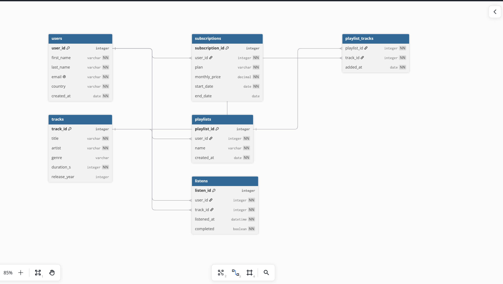

# 🎵 StreamSmart — Analyse RFM d'une plateforme de streaming musical

> Projet Final — Algo & Bases de Données | MSc2 Manager Data Marketing | INSEEC 2026

---

## 📌 Problématique métier

**Comment segmenter les utilisateurs d'une plateforme de streaming pour optimiser les campagnes de rétention et de monétisation ?**

À partir des données d'écoutes, d'abonnements et de playlists de 30 utilisateurs fictifs, ce projet construit un pipeline data complet : modélisation SQL → enrichissement API → algorithme RFM → dashboard interactif.

---

## 🗂️ Structure du projet

```
streamsmart/
├── streamsmart.sql     ← Schéma SQL complet (MySQL)
├── setup_db.py         ← Création de la base SQLite + insertion des données
├── main.py             ← Pipeline Python (Pandas + API Last.fm + RFM + écriture BDD)
├── dashboard.py        ← Dashboard interactif Plotly Dash
├── .env                ← Clé API Last.fm (non committée)
├── .gitignore
└── README.md
```

---

## 🗃️ Modélisation de la base de données

### Schéma (dbdiagram.io)



### Tables

| Table | Description |
|---|---|
| `users` | 30 utilisateurs avec pays et date d'inscription |
| `subscriptions` | Plan d'abonnement (free / premium / family) |
| `tracks` | 35 titres musicaux avec genre et durée |
| `playlists` | Playlists créées par les utilisateurs |
| `playlist_tracks` | Relation **many-to-many** entre playlists et tracks |
| `listens` | Historique d'écoutes avec horodatage |
| `rfm_segments` | Résultats RFM enrichis (générés par Python) |

### Éléments techniques SQL couverts

- ✅ Au moins 3 tables avec relations
- ✅ Relation many-to-many (`playlist_tracks`)
- ✅ Contraintes `FOREIGN KEY`, `NOT NULL`, `UNIQUE`
- ✅ 6 requêtes `SELECT` avec `WHERE`, `GROUP BY`, `HAVING`, `ORDER BY`, `LIMIT`
- ✅ Jointure sur 4 tables
- ✅ Sous-requête (utilisateurs au-dessus de la moyenne d'écoutes)
- ✅ Vue `v_user_stats`
- ✅ Procédure stockée `get_top_tracks_by_genre(genre, limit)`

---

## 🐍 Pipeline Python

### `setup_db.py`
Crée la base SQLite, insère toutes les données et crée la vue `v_user_stats`.

```bash
python setup_db.py
```

### `main.py`
Pipeline principal en 4 étapes :

1. **Connexion SQLite** via `sqlite3` + lecture avec `Pandas`
2. **Appel API Last.fm** — enrichissement des artistes avec leurs genres réels
3. **Algorithme RFM** — scoring sur 3 dimensions :
   - **Recency** : jours depuis la dernière écoute
   - **Frequency** : nombre total d'écoutes
   - **Monetary** : revenus estimés (monthly_price × mois d'abonnement)
4. **Écriture BDD** — résultats sauvegardés dans `rfm_segments`

```bash
python main.py
```

### Segments RFM

| Segment | Score RFM | Description |
|---|---|---|
| 🏆 Champion | 9 | Très actif, fidèle, rentable |
| 💚 Loyal | 7-8 | Actif et régulier |
| 💛 Potentiel | 5-6 | Montre des signaux positifs |
| 🟠 À risque | 4 | Activité en baisse |
| 🔴 Inactif | < 4 | N'écoute plus depuis longtemps |

---

## 📊 Dashboard interactif

```bash
python dashboard.py
# → http://127.0.0.1:8050
```

### Fonctionnalités

- **3 filtres interactifs** : Segment RFM / Plan d'abonnement / Pays
- **5 KPIs** : Utilisateurs, Champions, Récence moyenne, Écoutes moyennes, Revenus
- **5 graphiques** :
  - Camembert répartition des segments RFM
  - Scatter Recency vs Frequency (taille = Monetary)
  - Top 10 tracks les plus écoutées
  - Genres préférés enrichis via Last.fm
  - Évolution des écoutes dans le temps
- **Table utilisateurs** triable et filtrée dynamiquement

---

## 🔌 API utilisée

**Last.fm API** — `artist.gettoptags`  
Endpoint : `https://ws.audioscrobbler.com/2.0/`  
Usage : récupération du genre musical réel de chaque artiste pour enrichir la segmentation.

---

## ⚙️ Installation

```bash
# 1. Cloner le repo
git clone https://github.com/TON_GITHUB/streamsmart.git
cd streamsmart

# 2. Installer les dépendances
pip install pandas requests plotly dash python-dotenv

# 3. Configurer la clé API
echo "LASTFM_API_KEY=ta_cle_ici" > .env

# 4. Créer la base
python setup_db.py

# 5. Lancer le pipeline RFM
python main.py

# 6. Lancer le dashboard
python dashboard.py
```

---

## 🛠️ Stack technique

- **Python** 3.13 — pandas, requests, plotly, dash, sqlite3
- **SQLite** — base de données locale
- **Plotly Dash** — dashboard interactif
- **Last.fm API** — enrichissement des données

---

*Projet réalisé dans le cadre du cours Algo & BDD — INSEEC MSc2 Manager Data Marketing 2026*
